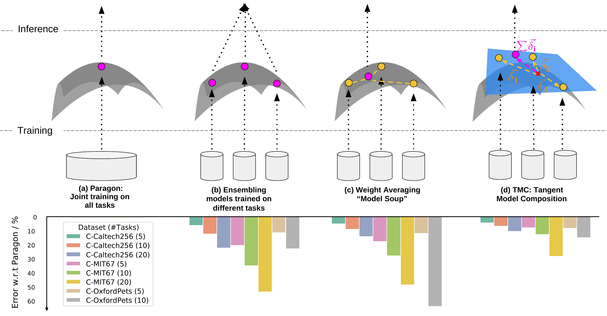

# Tangent Model Composition (ICCV 2023, ICLR 2024)


Official code repository for 
- [Tangent Model Composition for Ensembling and Continual Fine-tuning (ICCV 2023)](https://arxiv.org/abs/2307.08114) 
- [Tangent Transformers for Composition, Privacy and Removal (ICLR 2024)](https://arxiv.org/abs/2307.08122)

### Requirements
Our repository is based on PyTorch. We use Torch 1.12 and Python 3.9, other versions have not been tested.

In addition, the following packages are also needed:
```
pip install hydra-core==1.2.0
```

### Datasets
Create a folder for storing datasets in the main directory 
```
mkdir data
```
We provide example scripts for setting up MIT-67 and Oxford Pets in the `setup` directory
```
bash setup/setup_mit.sh
bash setup/setup_oxfordpets.sh
```

### Reproducing results
Our results for the Class Incremental (Class-IL) setting and Data Incremental (Data-IL) can be 
reproduced using 
```
bash scripts/compose.sh
```
and changing the variables appropriately.

For composition tasks on Tangent Transformers, an example script can be found in
```
bash scripts/compose_vit.sh
```
which can be adapted to one's needs. To obtain the best hyperparameters for each dataset, please refer
to Appendix A of the [original paper](https://arxiv.org/abs/2307.08122)


If you find this useful for your work, please consider citing
```
@inproceedings{liu2023tangent,
  title={Tangent Model Composition for Ensembling and Continual Fine-tuning},
  author={Liu, Tian Yu and Soatto, Stefano},
  booktitle={Proceedings of the IEEE/CVF International Conference on Computer Vision},
  pages={18676--18686},
  year={2023}
}

@inproceedings{liu2024tangent,
  title={Tangent Transformers for Composition, Privacy and Removal},
  author={Liu, Tian Yu and Golatkar, Aditya and Soatto, Stefano},
  journal={The Twelfth International Conference on Learning Representations},
  year={2024},
  url={https://arxiv.org/abs/2307.08122}
}
```


